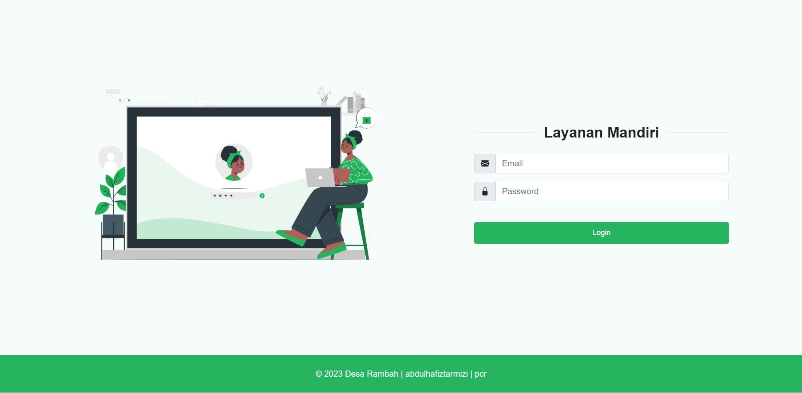
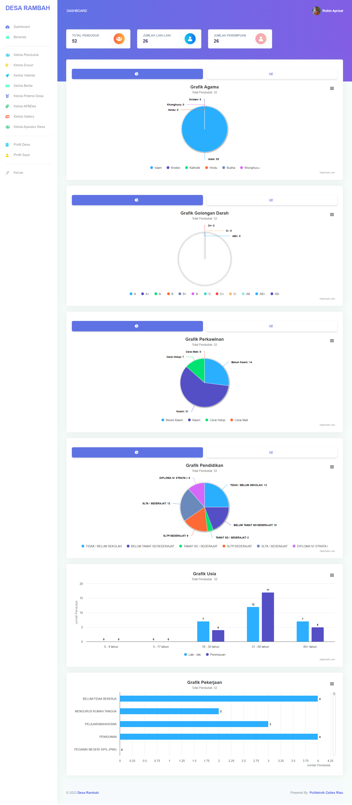

<p align="center"></p>

<p align="center">
<a href="https://travis-ci.org/laravel/framework"></a>
<a href="https://packagist.org/packages/laravel/framework"></a>
<a href="https://packagist.org/packages/laravel/framework"></a>
<a href="https://packagist.org/packages/laravel/framework"></a>
</p>

## Website Company Profile Desa Rambah
Pembangunan desa saat ini semakin melibatkan teknologi informasi guna memudahkan akses informasi bagi masyarakat. Hal ini sesuai dengan UU No. 25 Tahun 2009 yang menekankan pelayanan informasi yang luas dari pemerintah desa untuk masyarakat. Melalui penelitian yang menggali data dari Desa Digital Terbuka, terdapat manfaat signifikan dari implementasi sistem informasi di berbagai desa, termasuk akses yang lebih baik pada informasi desa, transparansi pemerintahan, dan efisiensi kantor desa.

Namun, Desa Rambah di Kecamatan Rambah Hilir, Kabupaten Rokan Hulu, masih menghadapi kendala dalam menyebarkan informasi secara luas. Dalam wawancara dengan staf desa, terungkap bahwa informasi disebarkan secara manual, membatasi jangkauan dan waktu, serta tidak tepat sasaran. Oleh karena itu, untuk mengatasi permasalahan tersebut, pembuatan website company profile menjadi pilihan solusi yang efektif.

Penelitian ini mengusulkan perancangan desain website company profile berbasis teknologi informasi. Dengan pendekatan design thinking, penelitian ini bertujuan memahami pengguna, mengidentifikasi masalah, dan menciptakan solusi inovatif melalui prototype yang diimplementasikan menjadi sistem website yang sesuai dengan kebutuhan pengguna.

## Cara Install Project DENGAN github desktop
Untuk menginstal project ini anda harus memiliki Composer
bagi yang belum install composer silahkan download [Klik di sini](https://getcomposer.org/download/1.9.0/composer.phar) tutorial cara instal composer [klik di sini](https://www.malasngoding.com/cara-install-composer/)

Bagi yang sudah memiliki composer silahkan ikuti tutor dibawah ini
- Klik tombol Clone or download
- Klik Open in desktop
- Klik open GithubDesktop.exe
- Silahkan pilih lokasi path yang anda inginkan
- Kemudian klik Clone
- Tunggu sampai proses clone selesai
- Buka folder porject yang sudah di clone melalui terminal
- Lakukan composer install ketik
```terminal
composer install
```
- Tunggu sampai proses selesai
- Buat database baru di phpmyadmin anda beri nama sesuka hati anda
- Copy file .env.example yang ada di dalam folder project dan ubah namanya menjadi .env
bagi yang menggunakan git bash atau terminal linux bisa ketik seperti dibawah
```terminal
cp .env.example .env
```
bagi yang menggunakan terminal windows bisa ketik seperti dibawah
```terminal
copy .env.example .env
```
- Lakukan generate key ketik 
```terminal
php artisan key:generate
```
- Buka file .env
- Ubah konfigurasi database sesuai nama database yang anda buat tadi lalu simpan
- lakukan migrate ketik :
```terminal
php artisan migrate --seed
```
- kemudian ketik :
```
php artisan storage:link
```
- Finish project laravel bisa dijalankan dengan menggunakan development server dengan cara ketik
```terminal
php artisan serve
```
- Lalu ctrl+klik pada http://127.0.0.0:8000

## Cara instal project TANPA github desktop
Bagi yang sudah memiliki composer silahkan ikuti tutor dibawah ini
- Klik tombol Clone or download
- Klik download zip
- Silahkan pilih lokasi path yang anda inginkan
- Kemudian klik Oke
- Tunggu sampai proses download selesai
- Extract here 
- Buka folder porject yang sudah di extract dengan terminal
- Lakukan composer install ketik
```terminal
composer install
```
- Tunggu sampai proses selesai
- Buat database baru di phpmyadmin anda beri nama sesuka hati anda
- Copy file .env.example yang ada di dalam folder project dan ubah namanya menjadi .env
bagi yang menggunakan git bash atau terminal linux bisa ketik seperti dibawah
```terminal
cp .env.example .env
```
bagi yang menggunakan terminal windows bisa ketik seperti dibawah
```terminal
copy .env.example .env
```
- Lakukan generate key ketik 
```terminal
php artisan key:generate
```
- Buka file .env
- Ubah konfigurasi database sesuai nama database yang anda buat tadi lalu simpan
- lakukan migrate ketik :
```terminal
php artisan migrate --seed
```
- kemudian ketik :
```
php artisan storage:link
```
- Finish project laravel bisa dijalankan dengan menggunakan development server dengan cara ketik
```terminal
php artisan serve
```
- Lalu ctrl+klik pada http://127.0.0.0:8000
- untuk login admin silakan explore dan konfigurasi by ur self

## Tampilan
- Tampilan untuk halaman utama

- Tampilan untuk halaman Login

- Tampilan untuk halaman Dashbaord Admin



## About Laravel

Laravel is a web application framework with expressive, elegant syntax. We believe development must be an enjoyable and creative experience to be truly fulfilling. Laravel takes the pain out of development by easing common tasks used in many web projects, such as:

- [Simple, fast routing engine](https://laravel.com/docs/routing).
- [Powerful dependency injection container](https://laravel.com/docs/container).
- Multiple back-ends for [session](https://laravel.com/docs/session) and [cache](https://laravel.com/docs/cache) storage.
- Expressive, intuitive [database ORM](https://laravel.com/docs/eloquent).
- Database agnostic [schema migrations](https://laravel.com/docs/migrations).
- [Robust background job processing](https://laravel.com/docs/queues).
- [Real-time event broadcasting](https://laravel.com/docs/broadcasting).

Laravel is accessible, powerful, and provides tools required for large, robust applications.

## Learning Laravel

Laravel has the most extensive and thorough [documentation](https://laravel.com/docs) and video tutorial library of all modern web application frameworks, making it a breeze to get started with the framework.

If you don't feel like reading, [Laracasts](https://laracasts.com) can help. Laracasts contains over 1500 video tutorials on a range of topics including Laravel, modern PHP, unit testing, and JavaScript. Boost your skills by digging into our comprehensive video library.

## Laravel Sponsors

We would like to extend our thanks to the following sponsors for funding Laravel development. If you are interested in becoming a sponsor, please visit the Laravel [Patreon page](https://patreon.com/taylorotwell).

- **[Vehikl](https://vehikl.com/)**
- **[Tighten Co.](https://tighten.co)**
- **[Kirschbaum Development Group](https://kirschbaumdevelopment.com)**
- **[64 Robots](https://64robots.com)**
- **[Cubet Techno Labs](https://cubettech.com)**
- **[Cyber-Duck](https://cyber-duck.co.uk)**
- **[Many](https://www.many.co.uk)**
- **[Webdock, Fast VPS Hosting](https://www.webdock.io/en)**
- **[DevSquad](https://devsquad.com)**
- [UserInsights](https://userinsights.com)
- [Fragrantica](https://www.fragrantica.com)
- [SOFTonSOFA](https://softonsofa.com/)
- [User10](https://user10.com)
- [Soumettre.fr](https://soumettre.fr/)
- [CodeBrisk](https://codebrisk.com)
- [1Forge](https://1forge.com)
- [TECPRESSO](https://tecpresso.co.jp/)
- [Runtime Converter](http://runtimeconverter.com/)
- [WebL'Agence](https://weblagence.com/)
- [Invoice Ninja](https://www.invoiceninja.com)
- [iMi digital](https://www.imi-digital.de/)
- [Earthlink](https://www.earthlink.ro/)
- [Steadfast Collective](https://steadfastcollective.com/)
- [We Are The Robots Inc.](https://watr.mx/)
- [Understand.io](https://www.understand.io/)
- [Abdel Elrafa](https://abdelelrafa.com)
- [Hyper Host](https://hyper.host)
- [Appoly](https://www.appoly.co.uk)
- [OP.GG](https://op.gg)
- [云软科技](http://www.yunruan.ltd/)

## Contributing

Thank you for considering contributing to the Laravel framework! The contribution guide can be found in the [Laravel documentation](https://laravel.com/docs/contributions).

## License

The Laravel framework is open-sourced software licensed under the [MIT license](https://opensource.org/licenses/MIT).
